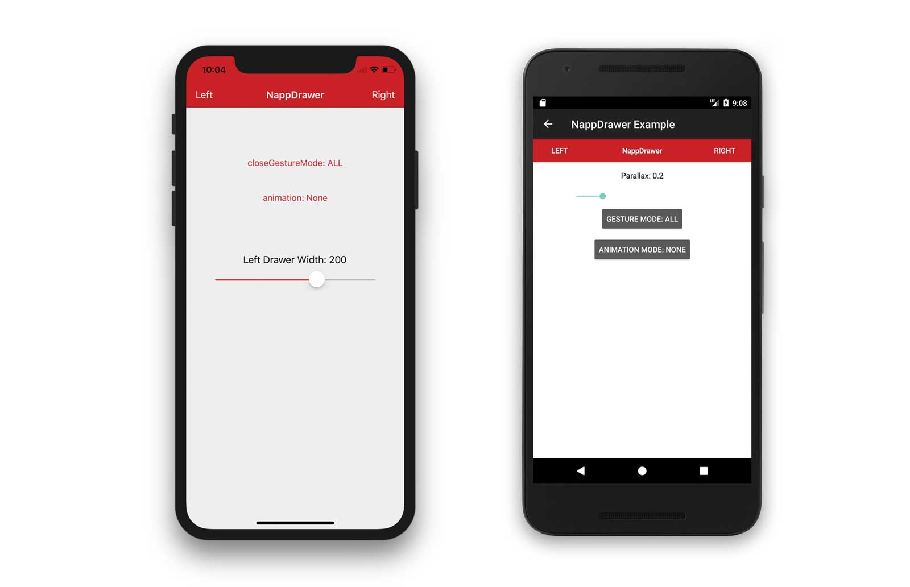

# Napp Drawer Module  

## Description

The Napp Drawer module extends the Appcelerator Titanium Mobile framework. 
The module is licensed under the MIT license.

There are **some minor platform parity differences** in this module. iOS version uses Windows whereas Android uses views. The android version still uses the same properties even though its views rather than windows, e.g. `isAnyWindowOpen()` is the exact same method call on each platform. 

## Quick Start

### Get it

Download the latest distribution ZIP-file and consult the [Titanium Documentation](http://docs.appcelerator.com/titanium/latest/#!/guide/Using_a_Module) on how install it

Or simply use the [gitTio CLI](http://gitt.io/cli) 

`$ gittio install dk.napp.drawer`

Or NPM 

`$ npm i --save ti-module-dk.napp.drawer`

## Community Driven

I encourage everyone to send Pull Requests - keeping this module flying with new features.

## Author

**Mads Møller**  
web: http://www.napp.dk  
email: mm@napp.dk  
twitter: @nappdev  

## License

    Copyright (c) 2010-2013 Mads Møller

    Permission is hereby granted, free of charge, to any person obtaining a copy
    of this software and associated documentation files (the "Software"), to deal
    in the Software without restriction, including without limitation the rights
    to use, copy, modify, merge, publish, distribute, sublicense, and/or sell
    copies of the Software, and to permit persons to whom the Software is
    furnished to do so, subject to the following conditions:

    The above copyright notice and this permission notice shall be included in
    all copies or substantial portions of the Software.

    THE SOFTWARE IS PROVIDED "AS IS", WITHOUT WARRANTY OF ANY KIND, EXPRESS OR
    IMPLIED, INCLUDING BUT NOT LIMITED TO THE WARRANTIES OF MERCHANTABILITY,
    FITNESS FOR A PARTICULAR PURPOSE AND NONINFRINGEMENT. IN NO EVENT SHALL THE
    AUTHORS OR COPYRIGHT HOLDERS BE LIABLE FOR ANY CLAIM, DAMAGES OR OTHER
    LIABILITY, WHETHER IN AN ACTION OF CONTRACT, TORT OR OTHERWISE, ARISING FROM,
    OUT OF OR IN CONNECTION WITH THE SOFTWARE OR THE USE OR OTHER DEALINGS IN
    THE SOFTWARE.
